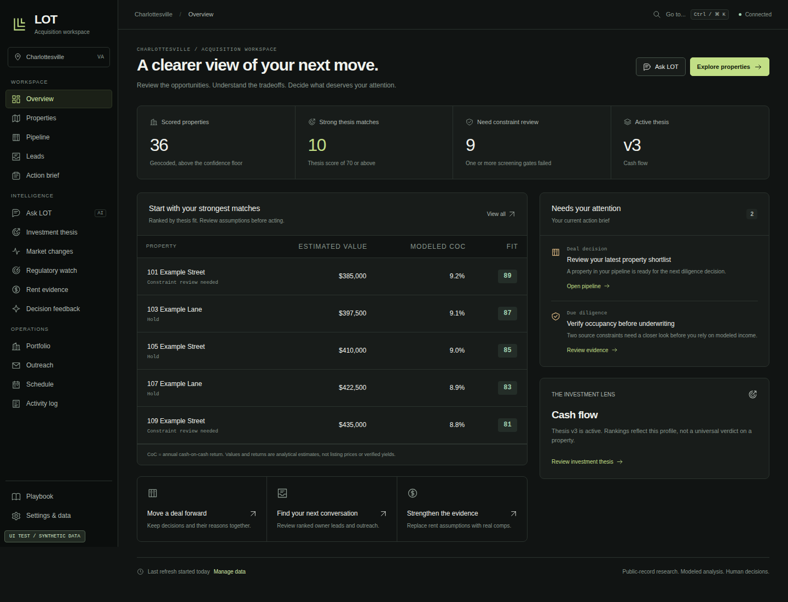

# LOT — Land of Opportunity Terminal

[](https://github.com/pegg-dot/real-estate-platform/actions/workflows/self-host-smoke.yml)
[](https://github.com/pegg-dot/real-estate-platform/actions/workflows/interface-verification.yml)
[](https://github.com/pegg-dot/real-estate-platform/actions/workflows/codeql.yml)
[](LICENSE)

**An explainable real-estate acquisition workspace that turns public parcel data into ranked opportunities, underwriting context, owner research, and a decision pipeline.**

Built by **Nate Pegg**. I started LOT around college-town buy-and-hold investing, with **Charlottesville and UVA** as the first fully wired market.



*Current LOT interface rendered by the production-browser regression suite with explicitly synthetic test records. The example addresses and figures above are not production data.*

## Why I built it

Property research is fragmented. County records, zoning, assessments, ownership, flood data, rent assumptions, financing possibilities, and the investor's actual thesis usually live in different places.

LOT is my attempt to make that process feel like one coherent workspace. The system separates sourced facts from modeled assumptions, scores properties against a specific investment thesis rather than a generic idea of a “good deal,” keeps screening constraints visible, and records the human decisions that move a deal forward.

The core loop is:

**SENSE → REASON → SHOW → DECIDE**

- **Sense:** collect parcel, zoning, assessment, ownership, flood, and market evidence from public or configured sources.
- **Reason:** normalize the evidence, score thesis fit, flag uncertainty, and model financing or exit possibilities.
- **Show:** surface the result in an overview, property workspace, dossier, leads, pipeline, and action brief.
- **Decide:** keep important constraints and the reason for each deal-stage change attached to the workflow.

## The product

### Acquisition overview

The overview answers a simple question: **what deserves attention next?** It combines the strongest thesis matches, properties that need constraint review, the current investment lens, and the action brief without inventing portfolio metrics that the underlying data cannot support.

### Property research

Browse properties in list, split, or map views. Search and filter by deterministic fields without requiring AI. The property list remains usable without a Mapbox token, while a configured token adds the interactive map and research lenses.

### Property dossier

A selected property opens into a focused dossier with **Overview, Underwriting, Owner, and Research** views. Sourced observations, modeled returns, data confidence, financing hypotheses, legal guardrails, and screening failures stay distinguishable instead of being flattened into a single score.

### Pipeline, leads, and action brief

LOT carries research into execution without pretending software makes the final decision. Deal-stage transitions retain a reason, owner motivation is labeled as an inference rather than verified intent, and the action brief prioritizes diligence or follow-up work.

## Design principles

- **Evidence before confidence.** Public records and configured providers are treated as evidence with provenance, not unquestionable truth.
- **Modeled means modeled.** Estimated values, rents, returns, motivation, and financing scenarios stay visibly distinct from sourced observations.
- **Thesis-specific ranking.** A score reflects the active investment thesis, not a universal verdict on a property.
- **Guardrails stay visible.** Zoning, occupancy, flood, financing, and legal constraints are not hidden just because a headline return looks attractive.
- **Human decisions remain human.** LOT can organize analysis and suggest next steps; it does not execute a real-estate transaction.

## Use LOT yourself

LOT is open source and intentionally self-hostable. The supported path is Docker Compose with PostgreSQL bundled in the stack.

<details>
<summary><strong>Quick start</strong></summary>

### Requirements

- [Docker Desktop](https://www.docker.com/products/docker-desktop/)
- [Git](https://git-scm.com/downloads)

### Start the app

```bash
git clone https://github.com/pegg-dot/real-estate-platform.git
cd real-estate-platform
cp .env.example .env
docker compose up -d --build
```

Load a small Charlottesville sample:

```bash
docker compose run --rm app lot refresh -- --market Charlottesville --distress --no-history --limit 500
```

Open **http://127.0.0.1:3000**.

The default app bind is localhost-only. PostgreSQL is bundled and its port is not published to the host by default.

### Optional map

Add a public Mapbox token to `.env`:

```text
NEXT_PUBLIC_MAPBOX_TOKEN=pk.your-token-here
```

Then restart the app:

```bash
docker compose up -d
```

The property list and core acquisition workflow still work without the map token.

</details>

For advanced configuration and troubleshooting, see [`docs/SELF_HOSTING.md`](docs/SELF_HOSTING.md).

## Optional integrations

The base product does not require an AI key. Optional integrations add conversational analysis, richer market evidence, or connected workflows.

| Capability | Configuration |
|---|---|
| Interactive map | `NEXT_PUBLIC_MAPBOX_TOKEN` |
| Conversational analysis and agent workflows | `ANTHROPIC_API_KEY` |
| Real rent comps | `RENTCAST_API_KEY` |
| Google sign-in and Gmail/Calendar connectors | `AUTH_*`, `GOOGLE_*`, `CONNECTOR_SECRET` |
| Additional enrichment | provider-specific variables in [`.env.example`](.env.example) |

## Security and self-hosting

The zero-config Docker setup is for a **single-user local machine** and does not enable authentication. The committed Docker configuration binds the application to `127.0.0.1` by default and does not publish PostgreSQL externally.

Before intentionally sharing a deployment, enable authentication, use HTTPS, configure a narrow allowlist, and store real credentials in the host's secret manager rather than Git.

The repository runs:

- dependency audits for the root and web dependency trees,
- TypeScript and unit tests,
- production Next.js builds,
- a clean Docker/PostgreSQL boot and migration/restart check,
- production-browser interface regressions using synthetic data,
- a tracked-secret/private-file policy check,
- CodeQL static analysis for JavaScript/TypeScript and Python.

See [`SECURITY.md`](SECURITY.md) for the supported security boundary and vulnerability-reporting process.

## Technical surface

LOT is a mixed TypeScript/Python system:

- **Next.js + React** for the acquisition workspace
- **TypeScript** for application, scoring, underwriting, financing, and orchestration logic
- **Python** for county/public-data ingestion
- **PostgreSQL + pgvector** for durable data and scored read models
- **Docker Compose** for the supported self-hosted environment
- optional **Anthropic, Mapbox, Google, and market-data providers**

Deeper technical documentation remains available for people who want to inspect or extend the project:

- [`docs/architecture.md`](docs/architecture.md)
- [`docs/data-model.md`](docs/data-model.md)
- [`docs/financing-engine-design.md`](docs/financing-engine-design.md)
- [`docs/interface-design.md`](docs/interface-design.md)

## Current scope

Charlottesville is the first fully wired county market adapter. Some inputs can be modeled when a configured source is unavailable, and those modeled values are intended to remain visibly distinguishable from sourced observations.

Creative-finance output is analytical software, not legal or financial advice. Real transactions can involve lender restrictions, due-on-sale provisions, title, tax, licensing, disclosure, fair-housing, and state-specific law. Use qualified professionals before acting on a financing structure.

## Open source, ownership, and attribution

Copyright © 2026 **Nate Pegg**.

LOT is released under the **MIT License**. You may use, modify, publish, distribute, sublicense, and sell copies under those terms. The MIT license requires the copyright notice and permission notice to remain in copies or substantial portions of the software.

That means reuse is welcome; it does **not** mean the original authorship disappears. The repository also includes [`CITATION.cff`](CITATION.cff), which gives GitHub a structured way to cite this project and makes attribution easy for derivative work, research, demos, and write-ups.

See [`LICENSE`](LICENSE) for the exact legal terms.

## Contributing

Contributions are welcome. Please read [`CONTRIBUTING.md`](CONTRIBUTING.md) before opening a pull request, especially the rules around synthetic test data, credentials, and provider integrations.

---

**Built by Nate Pegg.**
